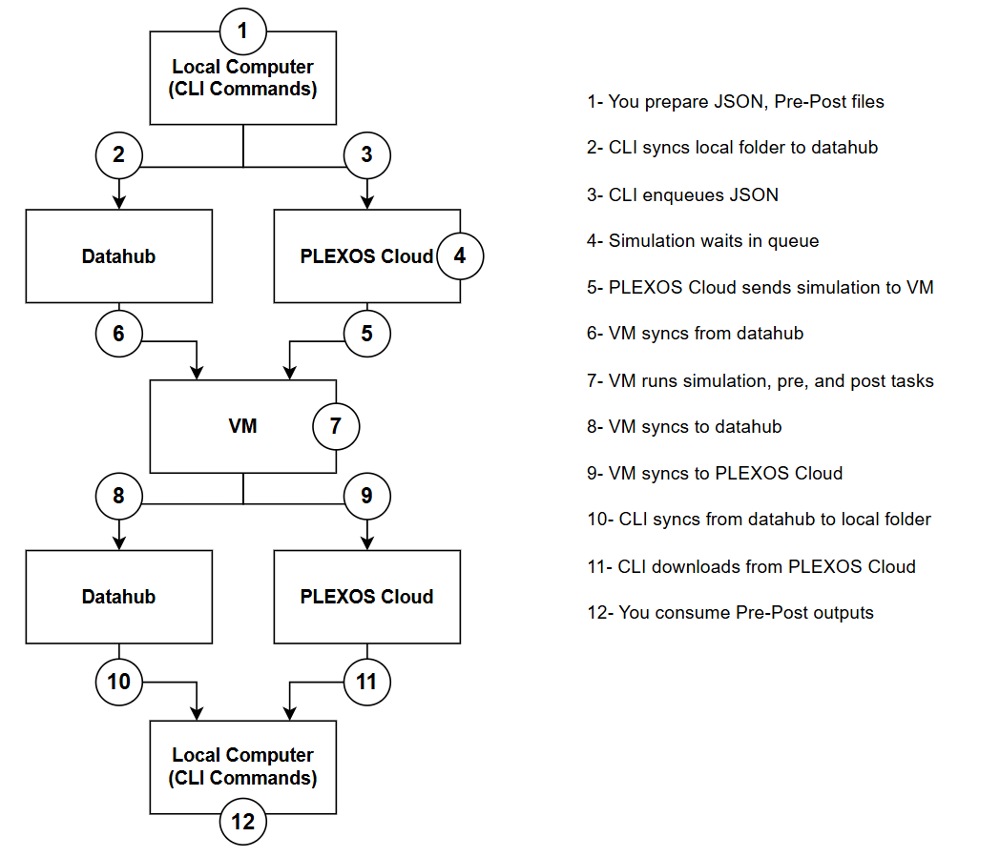

# PLEXOS Cloud – Simulation Workflow with Pre/Post Processing

This README explains **how PLEXOS Cloud executes simulations that include pre‑processing and post‑processing scripts**, and how data flows between your local machine, Datahub, PLEXOS Cloud, and the execution virtual machine (VM).

The workflow below is representative of typical automation using the **PLEXOS Cloud CLI**, **Datahub**, and **JSON-based job definitions**.

## High‑Level Architecture

**Main components:**

* **Local Computer (CLI)** – Where you prepare inputs, JSON job definitions, and pre/post scripts
* **Datahub** – Shared storage used to sync inputs and outputs (Cloud storage)
* **PLEXOS Cloud** – Job orchestration, queuing, and result management
* **Virtual Machine (VM)** – Executes the simulation and all pre/post logic

---

## Step‑by‑Step Workflow

### 1. Prepare Inputs Locally

You start on your **local machine** by preparing:

* Simulation input files (XML/databases)
* **Pre‑processing scripts** (e.g. Python)
* **Post‑processing scripts** (e.g. Python for result extraction, aggregation, validation)
* A **JSON job file** that defines:

  * Simulation configuration
  * References to pre/post scripts
  * Input/output directories

These files live in a local working folder.

---

### 2. Sync Local Folder to Datahub

Using the **PLEXOS Cloud CLI**, you sync your local working directory to **Datahub**.

At this point:

* All inputs
* Pre/post scripts
* Supporting files

are uploaded and available to the cloud execution environment.

---

### 3. Enqueue the Simulation Job

The CLI submits (enqueues) the **JSON job definition** to **PLEXOS Cloud**.

This step:

* Registers the job
* Associates it with your uploaded Datahub files
* Places the simulation into the execution queue

---

### 4. Job Waits in Queue

The simulation waits in the PLEXOS Cloud queue until:

* Resources are available
* A VM is assigned

No computation happens at this stage.

---

### 5. PLEXOS Cloud Dispatches Job to VM

Once resources are ready:

* PLEXOS Cloud assigns the job to a **virtual machine (VM)**
* The VM receives metadata describing:

  * Where to pull inputs from
  * Which scripts to execute
  * How to return outputs

---

### 6. VM Syncs Inputs from Datahub

Before execution begins, the VM:

* Syncs all required files from **Datahub**
* Recreates the working directory as defined locally

This ensures consistency between local development and cloud execution.

---

### 7. VM Runs Pre‑Processing, Simulation, and Post‑Processing

On the VM, execution typically follows this order:

1. **Pre‑processing scripts**

   * Modify inputs
   * Generate topology summaries
   * Validate or transform data

2. **PLEXOS simulation run**

   * Core model execution

3. **Post‑processing scripts**

   * Extract results
   * Aggregate outputs
   * Generate reports, CSVs, or summary files

All of this happens on the same VM in a single controlled environment.

---

### 8. VM Syncs Outputs Back to Datahub

After execution completes:

* All generated outputs
* Logs
* Post‑processed results

can be synced to **Datahub** or available in the solution package.

This makes results available outside the VM.

---

### 9. VM Syncs Metadata to PLEXOS Cloud

The VM reports execution status back to **PLEXOS Cloud**, including:

* Job success or failure
* Runtime information
* Output artifacts

This allows PLEXOS Cloud to mark the job as complete.

---

### 10. Sync Results from Datahub to Local Machine

Using the CLI, you sync results from **Datahub** back to your local folder.

This typically retrieves:

* Post‑processed CSVs
* Logs
* Task artifacts

---

### 11. Download Cloud‑Managed Outputs

Some outputs (e.g. packaged results, solution files, or metadata) are downloaded directly from **PLEXOS Cloud** via the CLI.

---

### 12. Consume Results Locally

Finally, on your local machine you:

* Analyze outputs
* Review logs
* Use post‑processed results for reporting, validation, or further automation

At this point the full pre → run → post workflow is complete.

---

## Additional Information

* **Datahub is the backbone** for file transfer between local, VM, and cloud
* **PLEXOS Cloud orchestrates**, but does not execute simulations itself
* **VMs do all computation**, including pre and post processing
* Local and cloud environments stay consistent through folder syncing

---

## Typical Use Cases

* Automated scenario generation
* Large batch runs with custom preprocessing
* Result aggregation and validation at scale
* Fully reproducible cloud‑based PLEXOS studies

